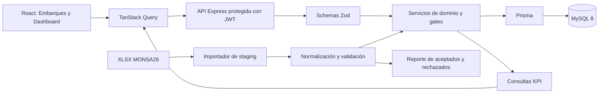

# Arquitectura del CRUD de embarques y KPI de `MONSA26`

## 1. Objetivo

Diseñar la ampliación del sistema MGC para capturar, consultar, actualizar, cancelar y medir la operación que hoy vive en la hoja `MONSA26` del archivo `Replica_REP_EMBARQUES_MGC26_DASHBOARD.xlsx`.

La solución se integra al stack y a las convenciones existentes: React + Vite + TypeScript + Tailwind CSS en frontend, Node.js + Express + TypeScript + Zod en backend, Prisma sobre MySQL 8 y TanStack Query para consultas y caché.

Este documento propone arquitectura y contratos. No implementa el CRUD ni migra datos.

Revisión de arquitectura incorporada el 2026-09-05: conservar el monolito modular y priorizar integridad de transiciones, concurrencia, migración histórica y consistencia de métricas antes de ampliar las pantallas. Las brechas de implementación indicadas abajo proceden de una revisión estática; los conteos del XLSX no se volvieron a conciliar.

**MVP implementado el 2026-09-05:** ver sección 16 para el alcance entregado, contratos, permisos, pruebas y pendientes. Las secciones anteriores describen la arquitectura objetivo; sus observaciones de código corresponden a la revisión previa al MVP.

## 2. Diagnóstico de la fuente

La hoja tiene 81 columnas, desde `A` hasta `CC`. Su dimensión declarada llega a 1,048,576 filas porque existen formatos y fórmulas arrastrados; no representa ese volumen de operación.

El universo útil se divide así:

| Concepto | Resultado |
| --- | ---: |
| Folios consecutivos en `B2:B201` | 200 |
| Filas con estado operativo | 36 |
| Folios reservados sin operación | 164 |
| Folios duplicados | 0 |
| Importaciones | 31 |
| Terrestres | 5 |
| Exportaciones | 0 |

Distribución de las 36 filas operativas:

| Dimensión | Valores observados |
| --- | --- |
| Estado | 14 `BOOKING CONFIRMED`, 10 `PARA CERRAR`, 10 `NUEVO EMBARQUE`, 2 `CANCELADO` |
| Modalidad de carga | 22 FCL, 6 LCL, 4 LTL, 1 FTL, 1 aéreo y 2 sin dato |
| Expediente físico | 14 sí y 22 no |
| Aviso registrado | 14 enviados y 22 sin registro |
| Seguro de mercancía | 5 sí y 31 no |
| Customer service | 35 asignados y 1 sin asignar |
| ETD | 24 capturados y 12 faltantes |
| ETA | 23 capturados y 13 faltantes |
| MBL | 12 capturados |
| HBL | 6 capturados |
| Profit y venta | 5 embarques con dato financiero |

Los cinco registros con información financiera suman USD 18,500.00 de venta sin IVA y USD 295.36 de profit; uno tiene pérdida. Estas cifras sirven para reconciliar una importación, pero no deben presentarse como desempeño total porque solo 5 de 36 embarques tienen captura financiera.

### 2.1 Riesgos de calidad detectados

- Diez columnas contienen fórmulas: `D`, `M`, `P`, `AX`, `BF`, `BG`, `BP`, `BQ`, `BS` y `BU`.
- `BP`, rotulada como fecha de entrega de vacío, usa `TODAY()` en las 200 reservas. No representa una fecha real de entrega.
- `BQ`, `BS` y `BU` calculan fechas o días aun cuando faltan sus fechas base. Hay 177 resultados con fecha anterior al año 2000 o magnitudes superiores a diez años.
- `H` tiene `NO` incluso en folios reservados. Un valor por defecto no convierte la fila en un embarque real.
- `U`, rotulada como número de póliza, mezcla `SI`, `NO` y un número largo mostrado en notación científica. El identificador debe almacenarse como texto.
- `N` y `BR` son dos columnas de comentarios sin autor ni fecha. El sistema debe convertirlas en bitácora.
- `AI` describe el tipo de entrega (`RAIL`, `HASTA PUERTO`, `ACARREO`), mientras `AY` contiene la modalidad de carga (`FCL`, `LCL`, `LTL`, etc.). No deben fusionarse.
- `AR` y `AS` mezclan estado y forma de liberación del BL: original, telex y sea waybill. El enum actual `DRAFT/FINAL` no conserva toda esa semántica por sí solo.

## 3. Principios de diseño

1. Un `Shipment` nace únicamente desde un `Booking` confirmado. No se crean 200 registros por reservar folios.
2. Los siete gates de la cascada actual siguen siendo obligatorios.
3. El borrado físico no forma parte del CRUD operativo. La operación se cancela y conserva su trazabilidad.
4. Fechas, conteos, alertas, tránsito, demoras y margen se calculan en backend; no se copian fórmulas del Excel.
5. Los valores de catálogo se normalizan antes de persistir. Espacios, acentos y variantes visuales no crean estados distintos.
6. Los recursos repetibles se modelan como relaciones: proveedores por rol, contenedores, comentarios, notificaciones y eventos.
7. Cada KPI publica su fórmula, denominador, filtros y tratamiento de nulos.
8. No se suman importes de distintas monedas sin un tipo de cambio explícito.

## 4. Arquitectura objetivo



La importación es una entrada controlada, no una dependencia de ejecución. Una vez migrados, los datos se operan únicamente desde MySQL y la API.

## 5. Modelo de dominio

### 5.1 Entidades existentes que se reutilizan

| Entidad | Responsabilidad |
| --- | --- |
| `Cliente` | Consignee, alias y datos maestros del cliente. |
| `Usuario` | Vendedor, customer service y responsables operativos. |
| `Cotizacion` | Incoterm, origen, destino, venta y compra estimadas. |
| `RoutingOrder` | Instrucciones recibidas y tipo de servicio de entrega. |
| `Booking` | SO o referencia del socio y proveedor principal. |
| `Shipment` | Núcleo operativo, fechas, ruta, carga, estado y valorización real. |
| `Documento` | MBL, HBL, manifiesto y estado documental. |
| `Contenedor` | Números, tipos y sellos; relación 1:N con `Shipment`. |
| `NotificacionEnviada` | Log inmutable de avisos al cliente. |
| `CostoDemora` | Días, costo y venta de demoras. |
| `Factura` | Número de factura MGC y ciclo fiscal. |
| `CuentaPorPagar` | Factura administrativa del proveedor y pago relacionado. |

### 5.2 Extensiones necesarias para cubrir la hoja completa

#### `ShipmentProveedor`

Relación N:N entre `Shipment` y `Proveedor` con rol. Resuelve que un embarque tenga simultáneamente agente, naviera, coloader, transportista, agente aduanal y aseguradora.

Campos mínimos:

| Campo | Tipo | Regla |
| --- | --- | --- |
| `id` | UUID | PK |
| `shipmentId` | UUID | FK a `Shipment` |
| `proveedorId` | UUID | FK a `Proveedor` |
| `rol` | enum | `AGENTE`, `NAVIERA`, `COLOADER`, `TRANSPORTISTA`, `AGENTE_ADUANAL`, `ASEGURADORA` |
| `referencia` | string nullable | Referencia específica del proveedor |
| `creadoEn` | datetime | Auditoría |

Restricción única sugerida: `@@unique([shipmentId, proveedorId, rol])`.

Antes de implementar, definir la cardinalidad por rol: esta restricción permite varios proveedores distintos con el mismo rol. El proveedor principal del booking y la aseguradora del seguro no deben poder contradecir sus asignaciones en `ShipmentProveedor`. Documentar una fuente canónica para cada relación y derivar su representación secundaria, o sincronizarla transaccionalmente. También debe aclararse si el agente del routing es una instrucción histórica o la asignación operativa vigente.

#### `Seguro`

Relación 1:1 con `Shipment`.

| Campo | Tipo | Regla |
| --- | --- | --- |
| `shipmentId` | UUID | Único y FK |
| `tipo` | enum | `MERCANCIA`, `INSPECCION_ORIGEN`, `OTRO` |
| `numeroPoliza` | string nullable | Nunca numérico |
| `numeroFacturaPoliza` | string nullable | Identificador externo |
| `aseguradoraId` | UUID nullable | FK a `Proveedor` |
| `comentarios` | text nullable | Excepción o alcance |

#### `BitacoraShipment`

Reemplaza las columnas de comentarios sin contexto.

| Campo | Tipo | Regla |
| --- | --- | --- |
| `id` | UUID | PK |
| `shipmentId` | UUID | FK e índice |
| `tipo` | enum | `OPERACION`, `DEMORA`, `DOCUMENTO`, `INCIDENCIA`, `OTRO` |
| `comentario` | text | Obligatorio |
| `autorId` | UUID | Sale del JWT |
| `creadoEn` | datetime | Inmutable |

Es append-only. No debe editarse ni borrarse.

La bitácora registra comentarios; no sustituye la auditoría automática de cambios descrita en la sección 12. En entradas importadas, el autor histórico puede ser desconocido: permitir `autorId` nullable para ese origen y registrar por separado quién ejecutó la importación. No atribuir el comentario original al importador ni presentar la fecha de importación como fecha del comentario histórico.

#### Campos operativos adicionales

Agregar a `Shipment` únicamente hitos fijos y consultables:

- `operativoId String?`, relación a `Usuario`.
- `referenciaSeguimientoLegacy String?`, solo para trazabilidad de migración.
- `finProduccion DateTime?`.
- `etaCliente DateTime?`.
- `fechaCargaGondola DateTime?`.
- `fechaArriboTerminal DateTime?`.
- `fechaEntregaVacio DateTime?`.
- `diasLibresDemora Int?`.
- `unidadCarga String?`, para pallets, cartones, bolsas o paquetes.

La ubicación de `fechaEntregaVacio` y `diasLibresDemora` en Shipment es provisional: si los contenedores tienen devoluciones o condiciones distintas, esos datos deben vivir por contenedor y las demoras del embarque se agregan desde ellos. Validar esta granularidad antes de la migración del modelo; no copiar una fecha única a todos los contenedores sin evidencia.

Agregar a `Documento`:

- `mblIncorrecto String?`.
- `montoDeclaradoMbl Decimal?`.
- `tarifaAplicadaMbl Decimal?` y `monedaTarifaMbl String?`.
- `fechaCorreccionMbl DateTime?`.
- `tipoLiberacionHbl TipoLiberacionBL?`.
- `tipoLiberacionMbl TipoLiberacionBL?`.
- `cartaGarantiaUrl String?`.

`TipoLiberacionBL`: `ORIGINAL`, `TELEX`, `SEA_WAYBILL`, `NO_APLICA`.

La patente aduanal pertenece al proveedor de tipo `AGENTE_ADUANAL`, no al shipment. Agregar `patenteAduanal String?` a `Proveedor` si el dato se usará de forma recurrente.

## 6. Mapeo completo de las 81 columnas

### 6.1 Identidad, responsables y seguimiento

| Col. | Origen | Destino canónico | Tratamiento |
| --- | --- | --- | --- |
| A | SEC | Ninguno | Número de fila de migración; no persistir. |
| B | FOLIO 2026 | `Shipment.folio` | Único, generado al confirmar booking. |
| C | Día en que se subió el routing | `RoutingOrder.fechaRecibido` / auditoría | No duplicar si ya existe el evento. |
| D | No. de semana | Derivado | Semana ISO de la fecha operativa acordada. |
| E | No. seguimiento en sistema | `Shipment.referenciaSeguimientoLegacy` | Solo migración; el UUID es la identidad real. |
| F | SO o número de socio | `Booking.referencia` | Texto nullable. |
| G | Importación o exportación | `Shipment.tipoOperacion` | Enum normalizado; incluye `TERRESTRE`. |
| H | Hay expediente | `Shipment.expedienteFisico` | `SI/NO` a boolean. |
| I | Consignee | `Shipment.consigneeId` | Resolver contra `Cliente`. |
| J | Alias | `Cliente.alias` | Dato maestro; no snapshot por embarque. |
| K | Shipper | `Shipment.shipperNombre` | Texto obligatorio al crear shipment. |
| L | Status | `Shipment.status` | Transición de dominio, no texto libre. |
| M | Estatus de material | `Shipment.estatusMaterial` | Actualización de tracking; conservar historial en auditoría. |
| N | Comentarios | `BitacoraShipment` | Importar como entrada `OPERACION`. |
| O | Notificación | `NotificacionEnviada` | Crear evento `AVISO_ARRIBO` solo si hay evidencia. |
| P | Debe enviar aviso de llegada | Derivado | ETA dentro de ventana, sin arribo real y sin aviso previo. |
| Q | Vendedor | `Cotizacion.vendedorId` | Resolver contra `Usuario`. |
| R | Customer service | `Shipment.customerServiceId` | FK nullable durante asignación. |
| S | Operativo de la cuenta | `Shipment.operativoId` | FK a `Usuario` con rol operativo. |

### 6.2 Seguro, órdenes y proveedores

| Col. | Origen | Destino canónico | Tratamiento |
| --- | --- | --- | --- |
| T | Seguro o inspección en origen | `Seguro.tipo` | Catálogo; `NO` significa ausencia de `Seguro`. |
| U | No. póliza | `Seguro.numeroPoliza` | Texto; `SI/NO` se rechaza o corrige. |
| V | Factura de póliza | `Seguro.numeroFacturaPoliza` | Texto nullable. |
| W | Empresa de seguro | `Seguro.aseguradoraId` | Resolver contra `Proveedor`. |
| X | Orden proveedor/cliente | `Shipment.poCliente` | Mantener como texto, incluso si contiene varias referencias. |
| Y | Incoterm | `Shipment.incoterm` | Normalizar contra catálogo. |
| Z | Agente | `ShipmentProveedor(AGENTE)` | Relación, no string en shipment. |
| AA | Naviera o transporte | `ShipmentProveedor(NAVIERA/TRANSPORTISTA)` | Rol según modalidad. |
| AB | Coloader | `ShipmentProveedor(COLOADER)` | Relación opcional. |
| AC | Código de tarifa VIP | `Tarifa.codigoExterno` opcional | Fuera del MVP si sigue vacío. |

### 6.3 Ruta y documentos

| Col. | Origen | Destino canónico | Tratamiento |
| --- | --- | --- | --- |
| AD | Vessel | `Shipment.vessel` | Texto nullable. |
| AE | Voyage | `Shipment.voyage` | Texto, nunca número. |
| AF | POL | `Shipment.puertoOrigen` | Catálogo normalizado a futuro. |
| AG | País POL | `Shipment.paisOrigen` | Catálogo normalizado. |
| AH | POD | `Shipment.puertoDestino` | Catálogo normalizado. |
| AI | Modalidad de entrega | `RoutingOrder.tipoServicioEntrega` | No confundir con `AY`. Requiere tabla de equivalencias. |
| AJ | Destino final | `Shipment.destinoFinal` | Texto nullable. |
| AK | MBL | `Documento.mbl` | Identificador documental. |
| AL | MBL wrong | `Documento.mblIncorrecto` | Registrar incidencia; no sobrescribir el MBL correcto. |
| AM | Monto declarado en MBL | `Documento.montoDeclaradoMbl` | Decimal con moneda explícita. |
| AN | Tarifa que aplica en MBL | `Documento.tarifaAplicadaMbl` | Decimal con moneda explícita. |
| AO | Fecha corrección MBL | `Documento.fechaCorreccionMbl` | Fecha nullable. |
| AP | BL House | `Documento.hbl` | Identificador documental. |
| AQ | Manifiesto | `Documento.manifiesto` | Texto nullable. |
| AR | Emisión HBL | `estatusEmisionHbl` + `tipoLiberacionHbl` | Separar `DRAFT/FINAL` de `ORIGINAL/TELEX`. |
| AS | Emisión MBL | `estatusEmisionMbl` + `tipoLiberacionMbl` | Separar estado de forma de liberación. |

### 6.4 Contenedores, modalidad y fechas

| Col. | Origen | Destino canónico | Tratamiento |
| --- | --- | --- | --- |
| AT | No. contenedor | `Contenedor.numero` | Separar listas por coma en filas 1:N. |
| AU | Contenedor 20 DC | Derivado de `Contenedor.tipo` | Usar como control de importación. |
| AV | Contenedor 40 DC/HC | Derivado de `Contenedor.tipo` | Usar como control de importación. |
| AW | Tipo de carga | `Contenedor.tipo` | Catálogo `20DC`, `40DC`, `40HC`, etc. |
| AX | Total contenedores | Derivado | `COUNT(Contenedor.id)`. |
| AY | FCL/LCL/aéreo/terrestre/seguro | `Shipment.modalidad` | Enum `ModalidadCarga`. |
| AZ | Fin de producción | `Shipment.finProduccion` | Fecha nullable. |
| BA | ETD | `Shipment.etd` | Fecha nullable. |
| BB | ETA | `Shipment.eta` | Fecha nullable. |
| BC | Arribo real a puerto | `Shipment.fechaArriboReal` | Fecha nullable. |
| BD | Liberación del embarque | `Shipment.fechaLiberacion` | Fecha nullable. |
| BE | ETA a cliente | `Shipment.etaCliente` | Fecha nullable. |
| BF | TT | Derivado | `DATEDIFF(eta, etd)` solo si ambas existen. |
| BG | Hoy | Derivado | Reloj del servidor; no persistir. |

### 6.5 Carga, terminal, demoras y finanzas

| Col. | Origen | Destino canónico | Tratamiento |
| --- | --- | --- | --- |
| BH | Gross weight | `Shipment.grossWeight` | Decimal; definir kg como unidad estándar. |
| BI | Total items | `Shipment.totalItems` | Entero no negativo. |
| BJ | CBM | `Shipment.cbm` | Decimal no negativo. |
| BK | Pallets/cartones/bolsas | `Shipment.unidadCarga` | Catálogo flexible. |
| BL | Carta garantía del año | `Documento.cartaGarantiaUrl` | Archivo opcional; no booleano textual. |
| BM | Días en puerto | Derivado | Desde arribo real hasta liberación o hoy. |
| BN | Cargado a góndola | `Shipment.fechaCargaGondola` | Fecha/evento; no booleano sin fecha. |
| BO | Arribo a terminal | `Shipment.fechaArriboTerminal` | Fecha nullable. |
| BP | Entrega de vacío | `Shipment.fechaEntregaVacio` | Captura real; nunca `TODAY()` automático. |
| BQ | Último día libre de demoras | Derivado | Fecha base + días libres - 1; null si falta un insumo. |
| BR | Comentarios | `BitacoraShipment` | Importar como entrada `DEMORA`. |
| BS | Total de días | Derivado | Diferencia entre fechas reales; null si falta una. |
| BT | Días de demoras otorgados | `Shipment.diasLibresDemora` | Entero no negativo. |
| BU | Demoras | Derivado | `MAX(días usados - días libres, 0)`. |
| BV | Costo de demoras | `CostoDemora.costoDemora` | Decimal + moneda. |
| BW | Venta demoras sin IVA | `CostoDemora.ventaDemoraSinIva` | Decimal + moneda. |
| BX | Factura administración | `CuentaPorPagar.numeroFactura` | Relacionar proveedor y shipment. |
| BY | Patente | `Proveedor.patenteAduanal` | Texto para conservar ceros. |
| BZ | Nombre AA | `ShipmentProveedor(AGENTE_ADUANAL)` | Resolver proveedor, no duplicar nombre. |
| CA | Profit MGC USD | Derivado | `valorizacionVenta - valorizacionCompra`; puede ser negativo. |
| CB | Venta sin IVA | `Shipment.valorizacionVenta` | Snapshot real confirmado por Ventas. |
| CC | Factura Monsa | `Factura.numeroFactura` | Se genera por el ciclo fiscal. |

## 7. CRUD y transiciones

### 7.1 Operaciones principales

| Acción | Endpoint | Regla |
| --- | --- | --- |
| Listar | `GET /api/shipments` | Paginación, búsqueda y filtros; no devolver 81 columnas planas. |
| Ver detalle | `GET /api/shipments/:id` | Incluye relaciones necesarias para el drawer. |
| Crear | `POST /api/shipments` | Solo desde booking confirmado; genera folio. |
| Editar | `PATCH /api/shipments/:id` | Solo estados operativos permitidos; aplica `limpiarEntrada()`. |
| Actualizar tracking | `PATCH /api/shipments/:id/tracking` | Fechas y estatus de material. |
| Confirmar valorización | `PATCH /api/shipments/:id/valorizacion` | Venta y compra reales; gate de facturación. |
| Cerrar | `PATCH /api/shipments/:id/cerrar` | Pasa a `PARA_FACTURAR` y devuelve divergencia de margen. |
| Cancelar | `PATCH /api/shipments/:id/cancelar` | Sustituye el borrado físico; exige motivo. |

La respuesta de lista debe ser liviana. El detalle puede incluir `booking.cotizacion`, cliente, usuarios, documentos, proveedores por rol, seguro, contenedores, demoras, notificaciones y bitácora.

### 7.2 Recursos hijos

| Recurso | Contrato sugerido |
| --- | --- |
| Documento | `PATCH /api/shipments/:id/documento` mediante upsert 1:1. |
| Contenedores | `POST /:id/contenedores`, `PATCH /:id/contenedores/:contenedorId`, `DELETE /:id/contenedores/:contenedorId`. |
| Proveedores por rol | `PUT /:id/proveedores` para reemplazo transaccional de asignaciones. |
| Seguro | `PUT /:id/seguro` y `DELETE /:id/seguro` mientras el shipment esté editable. |
| Demoras | `POST/PATCH/DELETE /:id/demoras`; los días calculados no se aceptan del cliente. |
| Notificaciones | `GET/POST /:id/notificaciones`; log sin PATCH ni DELETE. |
| Bitácora | `GET/POST /:id/bitacora`; log sin PATCH ni DELETE. |

Todas las escrituras compuestas deben usar una transacción Prisma.

### 7.2.1 Transiciones e integridad del expediente

- Definir una tabla explícita de estado origen, acción, estado destino, rol y condiciones. Los estados sin transición definida se rechazan; no existe un PATCH genérico de estado.
- Retirar `status` del contrato de tracking. Tracking modifica hitos y estatus de material; el estado operativo cambia mediante acciones de dominio.
- Cerrar debe validar el estado de origen: no puede retroceder un embarque `FACTURADO` o `TERMINADO`, ni reactivar uno `CANCELADO`. La lista definitiva de orígenes y cualquier reapertura requieren la matriz de negocio.
- Documento, contenedores, proveedores, seguro y demoras deben consultar la misma política de edición del expediente. Las correcciones posteriores al cierre necesitan una acción explícita y auditable.
- Cancelar exige motivo, autor y fecha, y una política definida para booking, facturas y cuentas relacionadas; no debe modificar sus ciclos implícitamente.
- La API debe devolver las acciones disponibles y su motivo de bloqueo para que la UI reutilice las reglas del backend. Cada escritura vuelve a validarlas, aunque la pantalla haya mostrado la acción habilitada.

Brechas observadas en el código revisado: `actualizarTrackingSchema` admite cualquier `StatusShipment`, `actualizarTracking` lo persiste sin controlar transiciones, `cerrarShipment` no comprueba el estado de origen y `actualizarDocumento` solo comprueba existencia. Corregir estas vías antes de habilitar nuevos recursos hijos.

### 7.2.2 Concurrencia e idempotencia

- Sustituir la generación de folios basada en leer el máximo y sumar uno por un consecutivo atómico por serie/año. Mantener la restricción única como defensa adicional; la migración debe ajustar el consecutivo al máximo histórico importado.
- Añadir una versión del expediente que el cliente envía al modificarlo. Actualizar solo si coincide y devolver conflicto si otro usuario ya guardó cambios. Las escrituras de recursos hijos deben participar en esa misma política cuando afecten al expediente.
- Validar gates y persistir dentro de la misma operación transaccional, con bloqueo o comprobaciones condicionales que impidan cambiar los prerrequisitos entre lectura y escritura. Una transacción de escrituras por sí sola no elimina las carreras.
- Definir el comportamiento ante reintentos para altas, cierre, cancelación e importación. Una repetición identificada no debe duplicar registros ni efectos; una solicitud distinta sobre un estado incompatible debe devolver un error de negocio.

### 7.3 Filtros de lista

`GET /api/shipments` debe aceptar:

- `q`: folio, MBL, HBL, SO, consignee, shipper, contenedor o factura.
- `status`, `tipoOperacion`, `modalidad`.
- `clienteId`, `vendedorId`, `customerServiceId`, `operativoId`, `proveedorId`.
- `etdDesde`, `etdHasta`, `etaDesde`, `etaHasta`.
- `conSeguro`, `conExpediente`, `conAvisoArribo`, `conPerdida`.
- `page`, `pageSize`, `sort`, `order`.

Los campos de orden deben pertenecer a una allowlist. `pageSize` debe tener un máximo de 100.

## 8. KPI

### 8.1 Contrato de consulta

Agregar un endpoint agregado para evitar que la UI descargue todos los registros:

```text
GET /api/dashboard/embarques
  ?desde=2026-01-01
  &hasta=2026-12-31
  &tipoOperacion=IMPORTACION
  &modalidad=FCL
  &clienteId=
  &vendedorId=
  &customerServiceId=
```

Respuesta sugerida:

```json
{
  "filtros": {},
  "kpis": {},
  "porStatus": [],
  "porModalidad": [],
  "porCliente": [],
  "porVendedor": [],
  "porCustomerService": [],
  "porProveedor": [],
  "serieSemanal": [],
  "alertas": []
}
```

### 8.2 Definiciones

| KPI | Fórmula y regla |
| --- | --- |
| Embarques creados | `COUNT(Shipment.id)` dentro del periodo; nunca contar folios reservados. |
| Embarques en curso | Estados `NUEVO_EMBARQUE`, `BOOKING_CONFIRMED` y `PARA_CERRAR`. |
| Por facturar | Estado `PARA_FACTURAR`. |
| Cancelados | Estado `CANCELADO`; mostrar conteo y tasa sobre creados. |
| Mix por operación | Conteo por `tipoOperacion`. |
| Mix por modalidad | Conteo por `modalidad`. |
| Expediente físico registrado | Conteo y porcentaje con `expedienteFisico = true`; no implica completitud documental. |
| ETA capturada | Porcentaje de embarques activos con `eta IS NOT NULL`. |
| Próximos arribos | ETA entre hoy y hoy + 10 días, sin arribo real. |
| Avisos pendientes | Próximos arribos sin `NotificacionEnviada(AVISO_ARRIBO)`. |
| Arribos atrasados | ETA anterior a hoy, sin arribo real y shipment activo. |
| Puntualidad | Arribos reales con `fechaArriboReal <= etaReferencia` / arribos con ambas fechas; acordar y conservar la ETA de referencia. |
| Tránsito estimado | Promedio de `DATEDIFF(eta, etd)` donde ambas fechas existan. |
| Tránsito real | Promedio de `DATEDIFF(fechaArriboReal, etd)` donde ambas existan. |
| Días en puerto | Promedio y máximo desde arribo real hasta liberación; abiertos usan hoy. |
| Contenedores | `COUNT(Contenedor.id)`. |
| TEU | 20 pies = 1; 40/45 pies = 2; excluir tipos desconocidos y reportarlos. |
| Embarques asegurados | Conteo y porcentaje con relación `Seguro`. |
| Documentación final | Porcentaje con MBL/HBL requeridos y estatus `FINAL`. |
| Demoras | Embarques con días de demora > 0, días totales, costo y venta. |
| Venta real | Suma de `valorizacionVenta` confirmada, agrupada por moneda. |
| Compra real | Suma de `valorizacionCompra` confirmada, agrupada por moneda. |
| Margen real | Venta real - compra real, por moneda. |
| Margen porcentual | `margen / venta * 100`; null si venta es cero. |
| Embarques con pérdida | Valorización confirmada con margen < 0. |
| Completitud | Porcentaje de campos obligatorios presentes según estado. |

Los KPI financieros deben mostrar cobertura: por ejemplo, `5 de 36 embarques valorizados`. Así se evita presentar un total parcial como total del negocio.

### 8.2.1 Contrato semántico compartido

- Cada indicador declara población, estados incluidos, fecha que determina el periodo, denominador, nulos y moneda. Distinguir embarques creados durante un periodo de embarques activos a una fecha de corte; reconstruir estos últimos requiere historial de estados.
- Acordar la zona horaria de negocio y los límites inclusivos/exclusivos del periodo. Distinguir fechas de calendario de instantes de auditoría; “hoy” no depende de la zona horaria accidental del servidor.
- Conservar `etaReferencia` y el origen de esa referencia para puntualidad, además de la ETA operativa editable. Cambiar la ETA actual no debe reescribir retrospectivamente el compromiso medido. La regla de selección se valida en la sección 15.
- Separar próximos arribos, arribos atrasados y avisos pendientes. Dashboard y Operaciones deben compartir filtros y funciones de cálculo; acordar si un aviso vencido permanece pendiente y, en ese caso, mostrarlo separado del próximo arribo.
- Diferenciar margen estimado de cotización y margen real de valorización confirmada. Agrupar también CxP y CxC por moneda; un monto sin moneda no es un total financiero válido.
- La completitud requiere una lista de campos/documentos exigidos por estado y modalidad. No inferirla de la existencia del expediente físico.
- Incluir en la respuesta fecha de cálculo, filtros efectivos y cobertura. Calcular conteos de shipments sin multiplicarlos por sus relaciones 1:N.

Brechas observadas: `rentabilidadPorEmbarque` usa importes de cotización pese a describirse como rentabilidad real; `kpis` suma márgenes y saldos sin separar monedas. `avisosArriboPendientes` incluye ETA vencida, mientras el tablero de Operaciones exige días para ETA no negativos. La implementación del nuevo endpoint debe corregir o adaptar también a esos consumidores existentes.

### 8.3 Índices recomendados

Conservar los existentes y agregar:

- `Shipment(status, eta)` para alertas de arribo.
- `Shipment(tipoOperacion, modalidad, creadoEn)` para filtros y series.
- `Shipment(customerServiceId, status)` y `Shipment(operativoId, status)`.
- `ShipmentProveedor(proveedorId, rol)`.
- `Contenedor(numero)`.
- `NotificacionEnviada(shipmentId, tipo, fechaEnviada)`.
- `BitacoraShipment(shipmentId, creadoEn)`.
- `Factura(numeroFactura)` ya único.

## 9. Backend

Mantener el patrón de cuatro archivos por módulo:

```text
backend/src/modules/shipments/
  shipment.schema.ts
  shipment.service.ts
  shipment.controller.ts
  shipment.routes.ts
```

Nuevos módulos sugeridos:

```text
backend/src/modules/seguros/
backend/src/modules/shipment-proveedores/
backend/src/modules/bitacora-shipments/
```

Responsabilidades:

- Schema Zod: tipos, nullables, fechas y mensajes legibles.
- Service: Prisma, transacciones, gates, cálculos derivados y normalización de dominio.
- Controller: adaptar request/response sin lógica de negocio.
- Routes: registrar endpoints con `asyncHandler`.

Los cálculos KPI viven en `dashboard.service.ts` o en un nuevo `embarque-kpi.service.ts` usado por el dashboard. No deben ejecutarse en React.

Extraer políticas de transiciones, edición y cálculo operativo compartidas dentro de los módulos existentes. Dashboard y Operaciones reutilizan esas políticas sin duplicar reglas. Mantener la separación entre consultas livianas de lista, detalle del expediente y agregados; no cargar todas las relaciones para obtener un conteo. Validar los índices propuestos contra las consultas y su volumen real antes de agregarlos indiscriminadamente.

## 10. Frontend

### 10.1 Página de embarques

Conservar `/embarques` y dividir la experiencia en:

- Cabecera y `CascadeStepper`.
- Filtros persistidos en query string.
- Tabla compacta: folio, cliente, operación, modalidad, estado, material, ETA, responsable y alertas.
- `DetalleDrawer` con todas las secciones, sin comprimir 81 columnas en la tabla.
- `FormularioEdicion` por secciones: general, responsables, ruta, carga, fechas, documentos, proveedores, seguro, demoras y valorización.
- Acciones visibles pero deshabilitadas con el motivo exacto del gate.
- Cancelación con motivo y confirmación explícita.

### 10.2 Dashboard

El dashboard debe incluir:

- KPI principales: en curso, por facturar, arribos pendientes, avisos pendientes, margen y cobertura de valorización.
- Barras por estado y modalidad.
- Serie semanal de embarques creados.
- Tablas de excepciones: atrasados, documentos pendientes, demoras y pérdidas.
- Filtros globales que afecten todas las tarjetas y series.

Usar la paleta de marca existente. Rojo solo para pérdidas, vencimientos y atrasos; verde para cierres o cumplimiento; amber para advertencias.

## 11. Importación inicial del XLSX

### 11.0 Contrato de migración histórica

Resolver este contrato antes de ampliar tablas o ejecutar la carga:

- El alta operativa exige cotización aceptada, routing cuando aplique y booking confirmado. El Excel no demuestra por sí solo todos esos prerrequisitos. Identificar qué relaciones existen, cuáles se pueden reconstruir con evidencia y cuáles quedan pendientes de revisión. No inventar importes estimados, aprobaciones o fechas para pasar los gates.
- Si negocio necesita un tratamiento excepcional para históricos incompletos, documentarlo y aprobarlo como política específica antes de implementarlo; no desactivar controles del alta normal. Mientras tanto, esas filas permanecen en staging.
- Conservar el folio histórico y distinguir fecha de importación de fecha operativa histórica. Mantener `creadoEn` como dato técnico y definir una fecha histórica con procedencia si se necesita medir creación operativa pasada. Si falta evidencia temporal, reportarla como desconocida; no concentrar artificialmente la serie histórica en el día de carga.
- Registrar lote, huella del archivo, versión de reglas/equivalencias, fila de origen y destino en un registro de migración separado del modelo operativo. Conservar valores originales necesarios para explicar cada transformación.
- Definir la reejecución: fila idéntica ya importada se omite; una diferencia se reporta para revisión y no sobrescribe silenciosamente cambios operativos posteriores. El folio único no basta para decidir qué actualizar.
- Cada unidad de importación debe ser transaccional con sus relaciones y trazabilidad. Definir recuperación de lotes parciales y probar restauración antes de la carga definitiva.
- Los 36 registros operativos son un control de la fuente, no una garantía de 36 registros insertables antes de resolver faltantes. El dry-run separa candidatos, aceptados, pendientes y reservas descartadas; el resultado final debe explicar cualquier diferencia con la sección 11.3.

### 11.1 Staging

El importador lee únicamente `MONSA26` en modo streaming y clasifica candidatos en aceptados, pendientes de resolución y rechazados, distinguiendo las reservas descartadas. No recorre hasta la fila 1,048,576; termina después del rango real de folios.

Una fila candidata debe tener al menos:

- folio con patrón `MGC26` + seis dígitos;
- estado operativo reconocido;
- consignee;
- tipo de operación.

Los 164 folios sin estado no se insertan como `Shipment`. Se reportan como reservas descartadas.

### 11.2 Normalización

- Aplicar `trim`, colapsar espacios y normalizar mayúsculas solo para comparar catálogos.
- Convertir `NA`, `N/A`, `NO APLICA`, guion y vacío a `null` según el campo.
- Mapear estados con espacios finales a enums Prisma.
- Mantener folios, pólizas, voyages, patentes y facturas como texto.
- Resolver clientes, usuarios y proveedores por tabla de equivalencias revisable; no crear duplicados silenciosamente.
- Separar contenedores escritos en una sola celda.
- No importar resultados de `TODAY()`, semanas, TT, alertas ni demoras calculadas.
- Guardar el número de fila de origen en el reporte de migración, no en el modelo operativo.

### 11.3 Reconciliación mínima

La primera corrida debe cuadrar con estos controles de la fuente:

- 36 embarques aceptados y 164 reservas rechazadas.
- Estados: 14/10/10/2 según la tabla del diagnóstico.
- Operación: 31 importaciones y 5 terrestres.
- Modalidad: 22 FCL, 6 LCL, 4 LTL, 1 FTL, 1 aéreo y 2 faltantes por corregir.
- 14 expedientes físicos y 5 seguros.
- 34 contenedores derivados de las columnas de 20 y 40 pies, sujetos a conciliación contra sus números.
- 5 registros valorizados, USD 18,500.00 de venta y USD 295.36 de profit; 1 con pérdida.

La migración no se confirma si los conteos cambian sin una explicación en el reporte.

## 12. Seguridad y auditoría

- Todas las rutas bajo `/api` usan `requireAuth`.
- Aplicar `requireRol` cuando se apruebe la matriz: Operaciones actualiza tracking; Ventas confirma valorización; Finanzas gestiona factura y cobranza; Admin cancela o corrige catálogos.
- `Usuario.passwordHash` nunca se incluye.
- En captura interactiva, notificaciones y bitácora obtienen el autor del JWT; para históricos aplicar la procedencia de la sección 11.0.
- Registrar cambios de estado, fechas críticas, valorización y cancelaciones en auditoría automática append-only: entidad/ID, acción, campo, valor anterior/nuevo, actor, fecha, motivo cuando aplique y correlación de solicitud o lote. Guardarla en la misma transacción que el cambio y excluir credenciales y secretos.
- No permitir edición de un shipment que ya sostiene documentos fiscales, salvo operaciones explícitamente autorizadas.
- Aprobar y aplicar la matriz de permisos antes de habilitar cancelación, valorización y correcciones para uso real. Incluir CUSTOMER_SERVICE y CONTABILIDAD en la definición, no solo los roles del ejemplo. La autenticación por sí sola no autoriza todas las acciones.

## 13. Pruebas

### Backend

- Unitarias para normalización de estados, modalidades, nulos y tipos de liberación BL.
- Unitarias para TT, puntualidad, días en puerto, último día libre, demora, TEU y margen.
- Integración para los siete gates y las transiciones de estado.
- Integración para filtros combinados y paginación.
- Integración para importación idempotente por folio.
- Integración para agregados KPI con fechas nulas, monedas distintas y embarques cancelados.
- Integración para transiciones prohibidas desde tracking, cierre de cancelados/facturados y edición de recursos hijos bloqueados.
- Concurrencia: altas simultáneas sin colisión de folios y dos ediciones sobre la misma versión sin pérdida silenciosa de cambios.
- Reintentos sin duplicar efectos, importaciones parciales recuperables y conflicto frente a históricos ya modificados en operación.
- Consistencia de alertas y poblaciones entre Dashboard y Operaciones, límites de fecha y conservación de la ETA de referencia.
- Auditoría atómica, procedencia de comentarios importados y autorización por rol en acciones críticas.

### Frontend

- Tabla y filtros sincronizados con URL.
- Formulario dividido por secciones y errores de negocio visibles.
- Acciones bloqueadas con tooltip, no ocultas.
- Dashboard con estados de carga, vacío, error y datos parciales.
- Contraste en modo claro y oscuro.

### Criterios de aceptación

1. No existe un shipment sin booking confirmado.
2. Cancelar conserva el registro y la trazabilidad.
3. Ningún KPI cuenta los 164 folios reservados.
4. Una fecha faltante produce `null`, nunca 46,000 días.
5. Profit negativo se conserva y se muestra como alerta.
6. Los totales financieros informan moneda y cobertura.
7. La lista responde paginada y el detalle contiene todas las relaciones.
8. La importación de prueba reconcilia los controles de la sección 11.3.
9. Tracking no cambia el estado operativo; cierre no retrocede registros facturados ni reactiva cancelados.
10. Las altas simultáneas generan folios distintos y las ediciones obsoletas devuelven conflicto.
11. Dashboard y Operaciones producen las mismas alertas para los mismos filtros y fecha de cálculo.
12. La carga histórica conserva folios y procedencia sin inventar prerrequisitos ni fechas; los faltantes quedan explicados en staging.
13. Cada cambio crítico registra auditoría en su transacción y exige el permiso correspondiente.

## 14. Orden de implementación

1. **Integridad:** corregir transiciones y política de edición compartida; implementar consecutivos atómicos y control de concurrencia con sus pruebas.
2. **Definiciones:** resolver contrato histórico, matriz de permisos, granularidad de demoras, fuentes canónicas de proveedores y semántica temporal/financiera de KPI. Aprobar equivalencias de `AI`, `AR`, `AS` y los dos registros sin modalidad `AY`.
3. **Modelo:** crear migraciones para relaciones, campos acordados, auditoría y trazabilidad de importación. Extender schemas, servicios, controladores y rutas con permisos y transacciones.
4. **Migración de prueba:** implementar dry-run idempotente y conciliar candidatos, aceptados, pendientes y reservas. Resolver faltantes y verificar recuperación antes de autorizar la carga definitiva.
5. **Consultas:** implementar lista paginada, detalle y endpoint agregado de KPI; unificar reglas con Dashboard y Operaciones y validar índices.
6. **Interfaz:** completar detalle, formulario, conflictos de edición, acciones con motivos de bloqueo y dashboard de excepciones.
7. **Validación y carga:** ejecutar las pruebas de integración y navegador, verificar respaldo/restauración y realizar la migración definitiva autorizada con reconciliación. Las pruebas de reglas acompañan cada etapa, no se posponen hasta este paso.

## 15. Decisiones que requieren validación de negocio

- Fecha base oficial para semana operativa: recepción del routing, creación del shipment o ETD.
- Equivalencia exacta de `RAIL`, `RAIL TRUCK`, `HASTA PUERTO`, `HASTA PUERTA` y `ACARREO` con `TipoServicioEntrega`.
- Si `MBL WRONG` debe ser un dato documental o una incidencia de bitácora.
- Moneda de montos declarados/tarifas MBL y de demoras.
- Definición de puntualidad: ETA original, última ETA actualizada o promesa contractual.
- Fecha base de días libres: ETA, arribo real o descarga del contenedor.
- Si la carta garantía se almacena como archivo, URL externa o documento generado.
- Matriz de permisos para cancelar, reabrir y corregir registros cerrados.
- Política de históricos sin cotización, importes, routing o booking documentados; fecha operativa histórica y tratamiento de datos desconocidos.
- Estado origen permitido para cada transición, efecto de cancelación sobre relaciones y condiciones de corrección posterior al cierre.
- Fecha de devolución del vacío y días libres por shipment o por contenedor.
- Cardinalidad por rol y fuente canónica de proveedores entre Booking, RoutingOrder, ShipmentProveedor y Seguro.
- Población y fecha de periodo por KPI, zona horaria de negocio, lista de completitud y tratamiento de avisos vencidos.

## 16. MVP operativo implementado (2026-09-05)

### 16.1 Alcance de esta entrega

- `/embarques`: alta desde booking confirmado disponible, búsqueda por folio/cliente/shipper/SO/MBL/HBL/contenedor/factura, filtros por estado, operación, modalidad, cliente, responsable y fechas de alta. Filtros en URL, paginación de 20 filas, detalle consultado al abrirlo y edición con detección de versión obsoleta.
- Se mantienen los componentes y estilos del sistema: PageHeader, CascadeStepper, DataTable, DetalleDrawer, FormularioEdicion, Modal, Card y KpiCard; paleta navy/teal/amber y modo claro/oscuro.
- Dashboard y Embarques consumen el mismo resumen: conteos operativos, próximos arribos, avisos pendientes, atrasos, cobertura y margen real por moneda. Dashboard agrega distribución por estado/modalidad y hasta 20 excepciones, informando el total. Sus tablas de cartera general conservan una ventana independiente de 45 días y se identifican como ajenas a los filtros de embarques.
- Cancelación con motivo, fecha, autor y registro persistente. Bloqueada si existe cualquier factura o CxP vinculada; no modifica silenciosamente el booking ni los ciclos financieros y no ofrece reapertura.
- Tracking no admite `status`. Edición, documentación y valorización aplican la misma política: estados abiertos hasta PARA_FACTURAR, sin factura FINAL. Cierre solo desde NUEVO_EMBARQUE/BOOKING_CONFIRMED/PARA_CERRAR, sin factura FINAL. No retrocede estados terminales.
- `Shipment.version`, `AuditoriaShipment` y `ConsecutivoShipment` incorporados mediante migración aditiva. Folios atómicos inicializados desde el máximo existente, transacciones serializables y reintentos acotados ante conflictos. Auditoría de alta, edición, tracking, documentación, valorización, cierre y cancelación; visible en detalle, últimos 50 cambios.
- Creación de facturas y alta/reasignación de CxP participan en transacciones para evitar carreras con cancelación. Una CxP nueva no puede asignarse a un embarque CANCELADO.

### 16.2 Contratos y decisiones del MVP

- `GET /api/shipments/pagina` devuelve `{ items, total, page, pageSize, pages }`. Orden permitido: creadoEn/folio/eta, con ID como desempate; pageSize máximo 100. El GET histórico `/api/shipments` conserva su respuesta de arreglo por compatibilidad con los selectores existentes; su migración completa a paginación queda pendiente.
- PATCH de edición, tracking, documento, valorización y cierre exige `version`. Cancelación: `PATCH /api/shipments/:id/cancelar` con `{ version, motivo }`. Un reintento con versión obsoleta devuelve 409 y no repite el efecto; no se implementó una clave de idempotencia general.
- `acciones.editar/cerrar/cancelar` contienen null cuando el dominio habilita la acción o el motivo de bloqueo. La UI combina esto con permisos por rol; la API vuelve a validar en cada escritura.
- Cancelar: ADMIN. Valorizar: VENTAS o ADMIN. Las demás rutas mantienen autenticación existente; la matriz completa por dominio sigue pendiente.
- `GET /api/dashboard/embarques` comparte filtros con la lista, sin paginación del agregado. Periodo por `creadoEn`, inicio incluido y día posterior al fin excluido, UTC-6 para el periodo operativo 2026. No representa un corte histórico de estados.
- Las fechas de tracking se tratan como fechas de calendario. Hoy se calcula en America/Mexico_City. Avisos pendientes: hoy a +10 días inclusive, sin arribo ni aviso previo. ETA vencida aparece por separado como atraso; no cuenta como aviso próximo.
- Margen real: únicamente valorizaciones confirmadas con ambos importes, excluyendo cancelados, en moneda de la cotización vinculada. Sumas decimales en backend; los importes del nuevo endpoint son cadenas decimales. Cobertura sobre seleccionados no cancelados; porcentaje de margen null con venta cero. No se introdujo conversión de moneda.
- Endpoints anteriores de rentabilidad/avisos adaptados a estas reglas. `/dashboard/kpis` agrega `porMoneda`; totales escalares y moneda son null cuando no hay una sola moneda. Resumen por vendedor agrupa también por moneda.

### 16.3 Verificación y ejecución

Desde `backend`:

```text
npm run prisma:generate
npx prisma migrate deploy
npm test
npm run test:integration
npm run build
```

Desde `frontend`: `npm run build` y `npm run dev`.

Las pruebas usan el runner nativo de Node y tsx, sin dependencias adicionales. `test:integration` lee DATABASE_URL, exige MySQL local, crea una base temporal `mgc_test_<timestamp>_<pid>`, aplica todas las migraciones, ejecuta API HTTP real con fixtures y elimina únicamente esa base al finalizar. Requiere permisos CREATE/DROP DATABASE; nunca resetea ni siembra la base de la aplicación. Una interrupción externa puede dejar la base temporal identificable para limpieza manual.

Cobertura: siete gates, autenticación/roles, estados prohibidos, motivos inválidos, folios y ediciones simultáneas, auditoría atómica, cancelación frente a altas financieras concurrentes, filtros/paginación, nulos, fechas límite, pérdidas, cobertura, separación de monedas y consistencia Dashboard/Operaciones. Estas pruebas validan los escenarios cubiertos; no equivalen a una garantía absoluta sobre todos los procesos del sistema.

### 16.4 Pendientes de la arquitectura objetivo

Importación histórica/staging y conciliación del XLSX, ShipmentProveedor, Seguro, bitácora de comentarios manuales, CRUD completo de contenedores/demoras, granularidad por contenedor, ETA contractual para puntualidad, cortes históricos, series semanales filtradas, matriz completa de roles y migración de todos los consumidores de listas. El MVP no inventa equivalencias ni aprobaciones para resolver esos pendientes.
